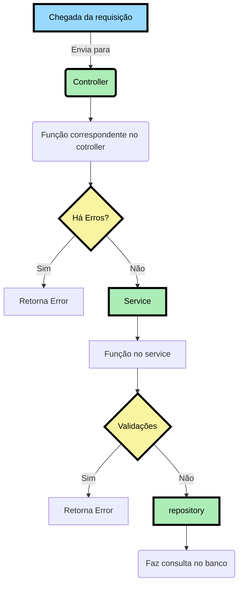

## Documentação Ada Web Planner 📕


[](https://docs.oracle.com/javase/21/docs/api/)


Projeto para o módulo de Programação Web II do Santander Coders.

O projeto *Ada Web Planner* é uma aplicação em Java desenvolvida como parte de um sistema de gerenciamento de tarefas.

## Demonstração da documentação ☕

<a href="https://ibb.co/zJC02N4"></a>

## Configurando e inicializando o projeto ☕

Primeiramente deverá fazer o clone da aplicação em sua máquina:

Através do https
```
    git clone https://github.com/elissatavares/ada-web-planner.git
```

Através do ssh
```
    git clone git@github.com:elissatavares/ada-web-planner.git
```

Utilizamos o `Maven` para instalar todas as depedências utilizadas no projeto. Para executar um build do projeto use o comando:

```
    mvn clean install
```
Para essa próxima etapa é necessário ter o  `docker e docker compose` instalado e configurado.

Navegue até a pasta config e execute o comando a seguir para inicilizar. 
```
    docker compose up
```

E, por fim, vá ate a classe  `PlannerApplication` para iniciar o servidor no endereço: [http://localhost:3000](http://localhost:8080)

📕 Para consultar a através do Swagger-ui vá para a [Documentação no Swagger](http://localhost:8080/swagger-ui/index.html).


## Dependências ☕

<ul>
    <li>
        <a href="https://mvnrepository.com/artifact/org.springframework.boot/spring-boot-starter-data-jpa">
            spring-boot-starter-data-jpa
        </a>
    </li>
    <li>
        <a href="https://mvnrepository.com/artifact/org.springframework.boot/spring-boot-starter-validation">
           spring-boot-starter-validation
        </a>
    </li>
    <li>
        <a href="https://mvnrepository.com/artifact/org.springframework.boot/spring-boot-starter-security">
            spring-boot-starter-security
        </a>
    </li>
    <li>
        <a href="https://mvnrepository.com/artifact/org.springframework.boot/spring-boot-starter-oauth2-resource-server">
            spring-boot-starter-oauth2-resource-server
        </a>
    </li>
    <li>
        <a href="https://mvnrepository.com/artifact/com.auth0/java-jwt">
            java-jwt
        </a>
    </li>
    <li>
        <a href="https://mvnrepository.com/artifact/org.springframework.boot/spring-boot-starter-web">
           spring-boot-starter-web
        </a>
    </li>
    <li>
        <a href="https://mvnrepository.com/artifact/org.postgresql/postgresql">
           postgresql
        </a>
    </li>
    <li>
        <a href="https://docs.spring.io/spring-security/reference/servlet/test/index.html">
           spring-security-test
        </a>
    </li>
           <li>
        <a href="https://spring.io/projects/spring-hateoas">
           spring-boot-starter-hateos
        </a>
    </li>
        </a>
    </li>
</ul>


## Fluxo da Aplicação ☕


## Endpoints / Rotas ☕

** Todas as informações nos endpoints entre parenteses "()" são os valores ou parâmetros

** Todas as informações nas requisições adicionadas do ícone "👤" são rotas que exigem autenticação(token) de usuário.

<h3>
    Register
</h3>

| Ação           | Requisição | Rota      |
|----------------|------------|-----------|
| Fazer o cadastro de login  | `POST`     | /planner/register    |

<h3>
    Login
</h3>

| Ação           | Requisição | Rota      |
|----------------|------------|-----------|
| Fazer o login  | `POST`     | /planner//login    |

<h3>
    Usuários
</h3>

| Ação                                                                                                         | Requisição | Rota                         | 
|--------------------------------------------------------------------------------------------------------------|------------|------------------------------|
|Exibe os detalhes do usuário         | `GET`   👤   | /planner                 | 
| Atualiza a senha de um usuário             |`PUT` 👤   | /planner            |
| Deletar o usuário           |`DELETE` 👤   | /planner            |

<h3>
   Task
</h3>

| Ação                                                                                 | Requisição | Rota                                   |
|--------------------------------------------------------------------------------------|------------|----------------------------------------|
| Exibe os detalhes de todas as tarefas de um usuário                                                             | `GET`  👤   | /planner/task                          |
| Cria uma tarefa                                                     | `POST` 👤  | /planner/task                              |
| Exibe os detalhes de uma tarefa específica de um usuário                                           | `GET` 👤   | /products/(id)                 |
| Deleta uma tarefa                                                                | `DELETE` 👤   | /planner/task/(id)         |
| Marca uma tarefa como concluída                          | `PATCH` 👤   | /planner/task/(id) |


## 🤝 Colaboradores
<a name="contribua"></a>
<table align="center"><tr>
 <td align="center"><a href="https://github.com/fernandacostads" target="_blank">
    <br />
    <sub><b>Fernanda Costa</b></sub></a>

<br />
<a href="https://www.linkedin.com/in/fernandacostads/" alt="LinkedIn">
  </a>
</td>
    <td align="center"><a href="https://github.com/ma-elissa" target="_blank">
    <br />
    <sub><b>Maria Elissa</b></sub></a>

<br />
<a href="https://www.linkedin.com/in/elissatavares/" alt="LinkedIn">
  </a>
</td>
  </tr>
</table>


## 😄 Seja um dos contribuidores!
Quer fazer parte desse projeto? Para contribuir, siga estas etapas:

1. Bifurque este repositório.
2. Crie um branch: git checkout -b <nome_branch>.
3. Faça suas alterações e confirme-as: git commit -m '<mensagem_commit>'
4. Envie para o branch original: git push origin <nome_do_projeto> / <local_>
5. Crie a solicitação de pull.

Como alternativa, consulte a documentação do GitHub em como criar uma solicitação pull.
Clique [AQUI](https://opensource.guide/how-to-contribute/) e leia como contribuir.


## 📝 Licença
Esse projeto está sob licença. Veja o arquivo [LICENÇA](https://github.com/elissatavares/ada-web-planner/blob/main/LICENSE.md) para mais detalhes.


<p align="right">(<a href="#readme-top">Voltar ao topo</a>)</p>
<hr>
<p align="center">Copyright © 2024 | Ada Web Planner by Fernanda Costa e Maria Elissa</p>


